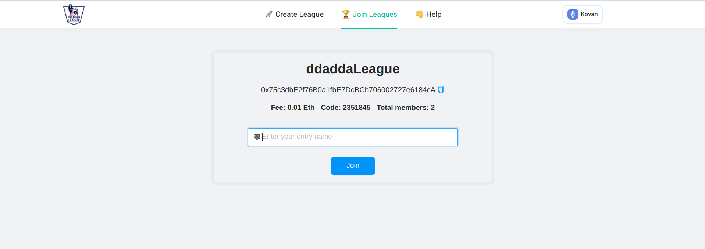
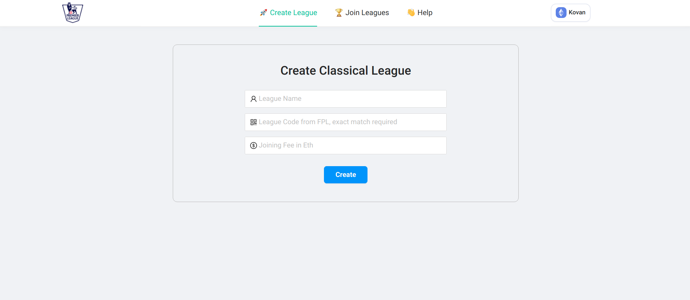
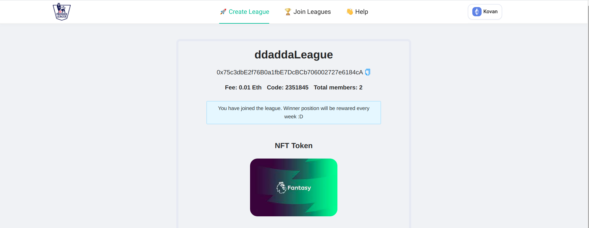

# Chain FPL

[Site Link (works on Kovan)](http://chainfpl.netlify.app/)

#### As Fantasy Premier League  allows users to host private leagues among their friends & certain communities. In such a case usually, one person hosts the league, collects the fees, and gives them to the winner. Here, we need to trust a person to collect fees and distribute them to the winner, and also transaction around the globe is not easy

#### ChainFPL uses smart contracts and chainlink to completely automate and remove the need for any central organizer. Anyone can trustlessly join the league of their favorite community and the winner gets instant payment without worrying about middle man or host. Moreover, when joining a league user gets NFT of that community. So, the community can organize exclusive events for NFT holders.

 

 

 

